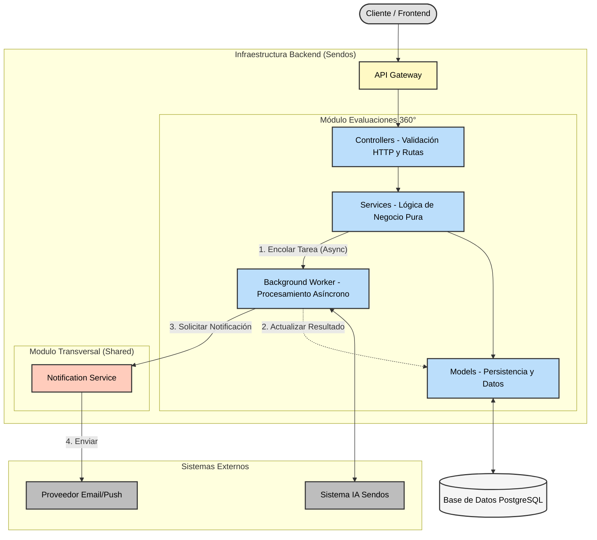
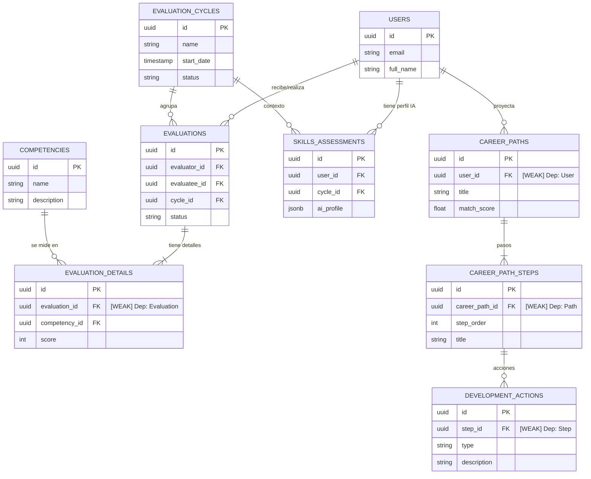

# Diseño de Arquitectura del Sistema

## 1.1 Diagrama de componentes


## 1.2 Especificación de Endpoints

### 1.2.1 Crear evaluación 360°
#### POST /api/v1/evaluations
Request: 
```json
{
  "employee_id": "uuid-user-1", 
  "evaluator_id": "uuid-user-2",
  "cycle_id": "uuid-cycle-2026-q1",
  "evaluator_relationship": "PEER",  
  "answers": [
    {
      "competency": "Liderazgo",
      "score": 8,
      "comments": "Demuestra gran capacidad..."
    },
    {
      "competency": "Comunicación",
      "score": 7,
      "comments": "Buena oratoria, falta escucha activa."
    }
  ],
  "general_feedback": "En general, es un excelente compañero de equipo."
}
```
Response 201: 
```json
{
  "id": "uuid-new-eval-1",
  "employee_id": "uuid-user-1",
  "status": "SUBMITTED",
  "created_at": "2026-01-20T10:30:00Z"
}
```
Response 400: 
```json
{
  "detail": "Invalid relationship. For 'SELF' type evaluations, the employee ID and the evaluator ID must match."
}
```
Response 404: 
```json
{
  "detail": "The specified employee (uuid-user-999) does not exist."
}
```
Response 409: 
```json
{
  "detail": "Duplicate evaluation. A record already exists for this employee-evaluator pair in the current cycle."
}
```
Response 422: 
```json
{
  "detail": [
    {
      "loc": ["body", "answers", 0, "score"],
      "msg": "ensure this value is less than or equal to 10",
      "type": "value_error.number.not_le"
    }
  ]
}
```

### 1.2.2 Obtener evaluación
#### GET /api/v1/evaluations/{evaluation_id}
Response 200:
```json
{
  "employee_id": "uuid-user-1", 
  "evaluator_id": "uuid-user-2",
  "cycle_id": "uuid-cycle-2026-q1",
  "evaluator_relationship": "PEER",  
  "answers": [
    {
      "competency": "Liderazgo",
      "score": 8,
      "comments": "Demuestra gran capacidad..."
    },
    {
      "competency_id": "Comunicación",
      "score": 7,
      "comments": "Buena oratoria, falta escucha activa."
    }
  ],
  "general_feedback": "En general, es un excelente compañero de equipo."
  "status": "COMPLETED"
  "updated_at": "2026-01-20T10:35:00Z"
}
```
Response 403: 
```json
{
  "detail": "You do not have permission to view this career plan."
}
```
Response 404: 
```json
{
  "detail": "Evaluation with ID {uuid} not found."
}
```
Response 422: 
```json
{
  "detail": [
    {
      "loc": ["path", "evaluation_id"],
      "msg": "value is not a valid uuid",
      "type": "type_error.uuid"
    }
  ]
}
```
### 1.2.3 Procesar con IA
#### POST /api/v1/evaluations/{evaluation_id}/process
Request: 
```json
{}
```
Response 202:
```json
{
  "message": "Processing started",
  "task_id": "uuid-task-99",
  "status": "PROCESSING"
}
```
Response 403: 
```json
{
  "detail": "You do not have permission to modify this evaluation."
}
```
Response 404: 
```json
{
  "detail": "Evaluation with ID {uuid} not found."
}
```
Response 409: 
```json
{
  "detail": "The evaluation is already being processed."
}
```
Response 422: 
```json
{
  "detail": [
    {
      "loc": ["path", "evaluation_id"],
      "msg": "value is not a valid uuid",
      "type": "type_error.uuid"
    }
  ]
}
```

### 1.2.4 Obtener assessment de habilidades
#### GET /api/v1/skills-assessments/{user_id}
Response 200:
```json
{
  "assessment_id": "uuid-assessment-001",
  "user_id": "uuid-user-1",
  "skills_profile": {
    "strengths": [
      {
        "skill": "Comunicación",
        "proficiency_level": "Avanzado",
        "score": 7.8,
        "evidence": "Consistentemente evaluado positivamente por pares y equipo"
      },
      {
        "skill": "Trabajo en Equipo",
        "proficiency_level": "Avanzado",
        "score": 8.2,
        "evidence": "Excelente colaboración interdepartamental"
      }
    ],
    "growth_areas": [
      {
        "skill": "Liderazgo",
        "current_level": "Intermedio",
        "target_level": "Avanzado",
        "gap_score": 1.2,
        "priority": "Alta"
      },
      {
        "skill": "Pensamiento Estratégico",
        "current_level": "Básico",
        "target_level": "Intermedio",
        "gap_score": 2.1,
        "priority": "Media"
      }
    ],
    "hidden_talents": [
      {
        "skill": "Gestión de Conflictos",
        "evidence": "Identificado a través de análisis de feedback cualitativo",
        "potential_score": 8.5
      }
    ]
  },
  "readiness_for_roles": [
    {
      "role": "Gerente Regional",
      "readiness_percentage": 65,
      "missing_competencies": ["Pensamiento Estratégico", "Gestión de P&L"]
    },
    {
      "role": "Gerente de Capacitación",
      "readiness_percentage": 78,
      "missing_competencies": ["Diseño Instruccional"]
    }
  ],
  "timestamp": "2025-01-15T10:30:00Z"
}
```
Response 403: 
```json
{
  "detail": "You do not have permission to view these skill assessments."
}
```
Response 404: 
```json
{
  "detail": "Employee with ID {uuid} not found."
}
```
Response 404: 
```json
{
  "detail": "No skills assessments have been processed for this employee yet."
}
```
Response 422: 
```json
{
  "detail": [
    {
      "loc": ["path", "user_id"],
      "msg": "value is not a valid uuid",
      "type": "type_error.uuid"
    }
  ]
}
```

### 1.2.5 Obtener senderos generados
#### GET /api/v1/career-paths/{user_id}
Response 200:
```json
{
  "career_path_id": "uuid-cp-gen-001",
  "user_id": "uuid-user-1",
  "generated_paths": [
    {
      "path_id": "uuid-path-01",
      "path_name": "Ruta de Liderazgo Regional",
      "recommended": true,
      "total_duration_months": 24,
      "feasibility_score": 0.85
    },
    {
      "path_id": "uuid-path-02",
      "path_name": "Ruta de Especialización en Operaciones",
      "recommended": false,
      "total_duration_months": 18,
      "feasibility_score": 0.72
    }
  ],
  "timestamp": "2025-01-15T10:35:00Z"
}
```
Response 403: 
```json
{
  "detail": "You do not have permission to view these paths."
}
```
Response 404: 
```json
{
  "detail": "Employee with ID {uuid} not found."
}
```
Response 404: 
```json
{
  "detail": "No paths have been created for this employee yet."
}
```
Response 422: 
```json
{
  "detail": [
    {
      "loc": ["path", "user_id"],
      "msg": "value is not a valid uuid",
      "type": "type_error.uuid"
    }
  ]
}
```

### 1.2.6 Obtener pasos detallados de un sendero
#### GET /api/v1/career-paths/{path_id}/steps
Response 200:
```json
{
  "path_id": "uuid-path-01",
  "path_name": "Ruta de Liderazgo Regional",
  "steps": [
    {
      "step_number": 1,
      "target_role": "Gerente de Sucursal Senior",
      "duration_months": 12,
      "required_competencies": [
        {
          "name": "Pensamiento Estratégico",
          "current_level": 5,
          "required_level": 7,
          "development_actions": [
            "Curso: Estrategia de Negocios Avanzada",
            "Proyecto: Plan estratégico para sucursal",
            "Mentoria con Gerente Regional"
          ]
        }
      ]
    },
    {
      "step_number": 2,
      "target_role": "Gerente Regional",
      "duration_months": 12,
      "required_competencies": [
        {
          "name": "Gestión de P&L",
          "current_level": 4,
          "required_level": 8,
          "development_actions": [
            "Certificación: Finanzas para Managers",
            "Shadowing: Director Financiero"
          ]
        }
      ]
    }
  ]
}
```
Response 403: 
```json
{
  "detail": "You do not have permission to view this path."
}
```
Response 404: 
```json
{
  "detail": "Path with ID {uuid} not found."
}
```
Response 422: 
```json
{
  "detail": [
    {
      "loc": ["path", "path_id"],
      "msg": "value is not a valid uuid",
      "type": "type_error.uuid"
    }
  ]
}
```
### 1.2.7 Marcar un sendero como aceptado por el usuario
#### POST /api/v1/career-paths/{path_id}/accept
Request: 
```json
{}
```
Response 200:
```json
{
  "path_id": "uuid-path-01",
  "user_id": "uuid-user-1",
  "status": "IN_PROGRESS",
  "started_at": "2026-01-20T12:00:00Z",
  "message": "Path accepted."
}
```
Response 403: 
```json
{
  "detail": "You do not have permission to modify this career plan."
}
```
Response 404:
```json
{ 
  "detail": "Path whit ID {uuid} not found." 
}
```
Response 409:
```json
{ 
  "detail": "This career plan is already underway.." 
}
```
Response 422:
```json
{
  "detail": [
    {
      "loc": ["path", "path_id"],
      "msg": "value is not a valid uuid",
      "type": "type_error.uuid"
    }
  ]
}
```
### 1.2.8 (Adicional) Obtener la lista de evaluaciones del usuario
#### GET /api/v1/evaluations
Response 200:
```json
[
  {
    "id": "uuid-eval-1",
    "user_id": "uuid-user-1",
    "evaluator_id": "uuid-user-2",
    "cycle_id": "uuid-cycle-2026-q1",
    "evaluator_relationship": "peer", 
    "status": "COMPLETED",
    "created_at": "2026-01-20T10:00:00Z"
  },
  {
    "id": "uuid-eval-2",
    "user_id": "uuid-user-1",
    "evaluator_id": "uuid-user-3",
    "cycle_id": "uuid-cycle-2026-q1",
    "evaluator_relationship": "manager",
    "status": "SUBMITTED",
    "created_at": "2026-01-20T11:00:00Z"
  }
]
```
Response 401: 
```json
{
   "detail": "Authentication credentials not provided or invalid."
}
```

## Diseño de Modelo de Datos


### Constraints y validaciones
#### 1.3.1 Unicidad de Evaluaciones
Regla: No pueden existir dos evaluaciones distintas para el mismo par (Evaluador, Evaluado) dentro del mismo Ciclo.
Sea E el conjunto de todas las Evaluaciones.
Sea e.evaluator, e.evaluatee, e.cycle los atributos de una evaluación e.

∀ e1, e2 ∈ E :
    (e1.evaluator = e2.evaluator ∧
     e1.evaluatee = e2.evaluatee ∧
     e1.cycle = e2.cycle)
    ⟹ e1 = e2

#### 1.3.2 Validez de Puntajes
Regla: Todo puntaje asignado en un detalle de evaluación debe estar dentro del rango [1, 10].
Sea D el conjunto de todos los Detalles de Evaluación (EvaluationDetails).
Sea d.score el puntaje asignado.

∀ d ∈ D : (d.score ≥ 1 ∧ d.score ≤ 10)

#### 1.3.2 Coherencia Temporal de Ciclos
Regla: Un ciclo no puede terminar antes de empezar.
Sea C el conjunto de Ciclos de Evaluación.

∀ c ∈ C : c.start_date < c.end_date
