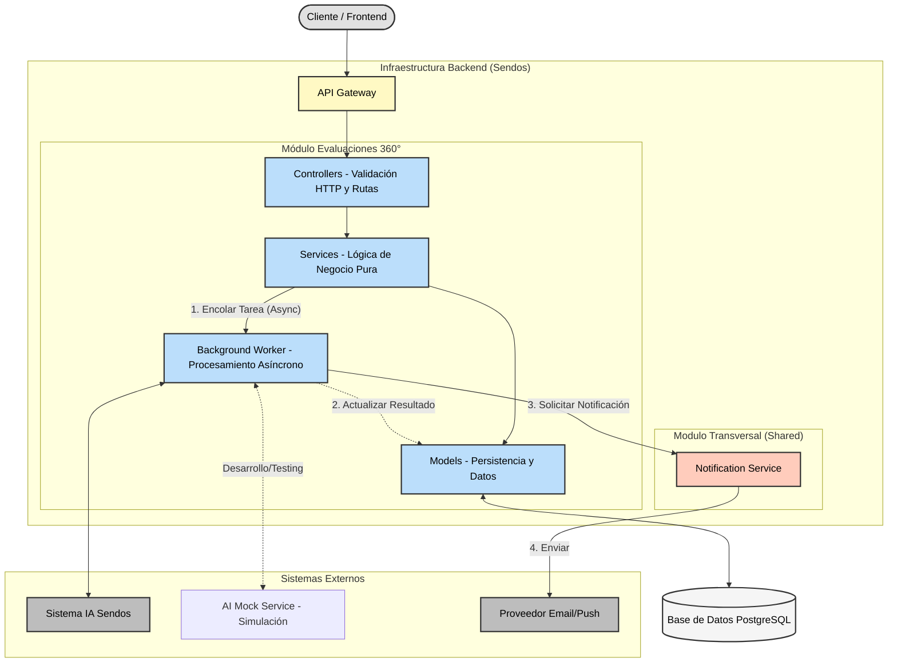
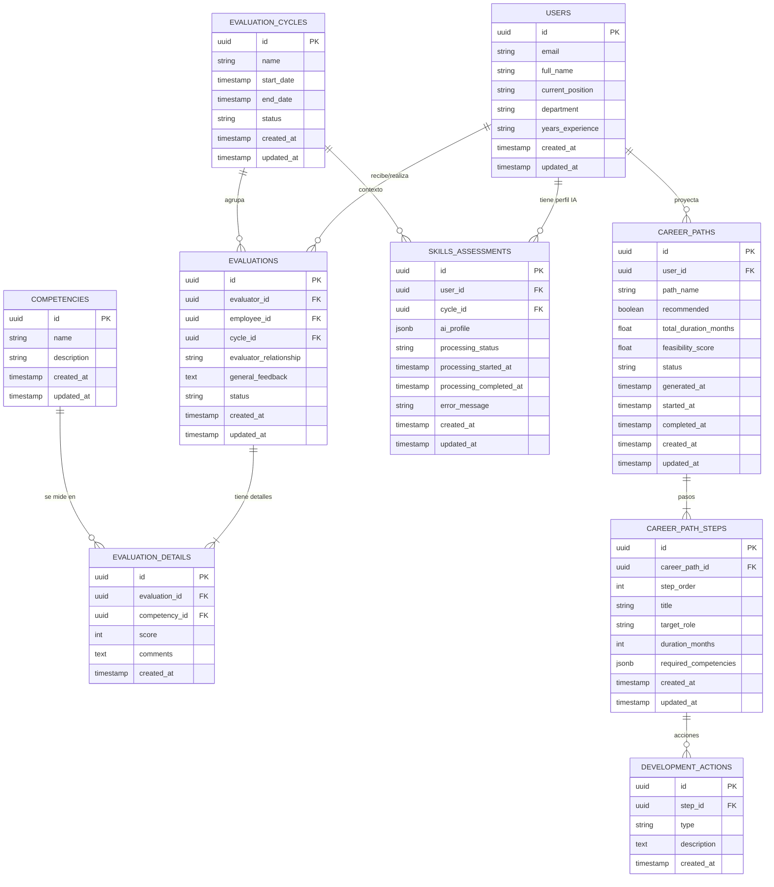
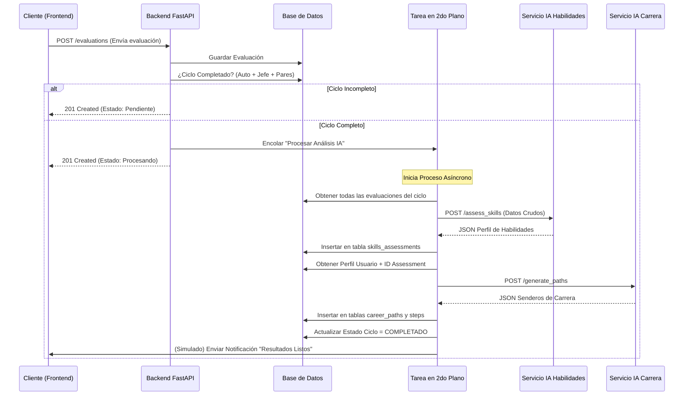
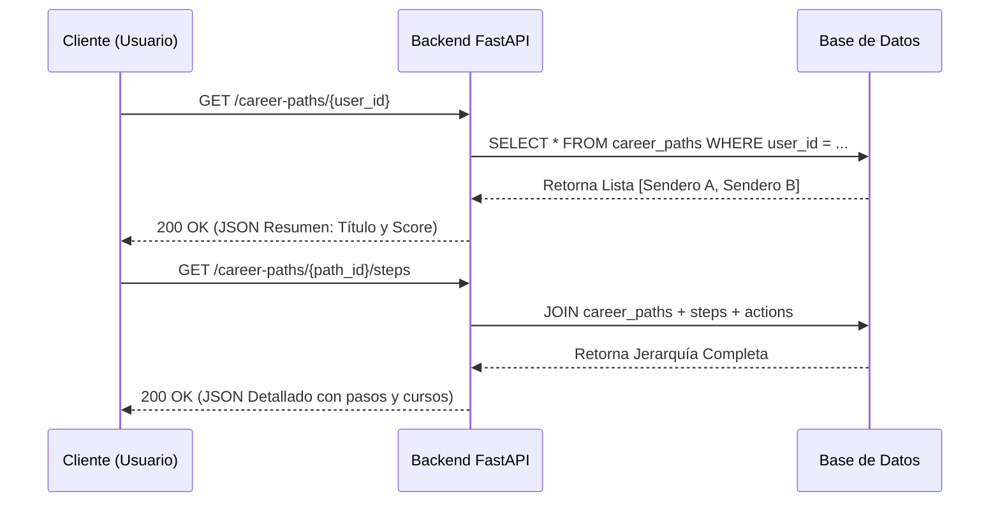

# Diseño de Arquitectura del Sistema

## 1.1 Diagrama de componentes


## 1.2 Convenciones de Código y Estándares

El proyecto sigue convenciones estrictas para garantizar consistencia, mantenibilidad y calidad del código:

### 1.2.1 Convenciones de Nomenclatura

**Campos de Base de Datos y Modelos:**
- **snake_case** para todos los nombres de columnas y atributos
  - Ejemplos: `user_id`, `created_at`, `evaluator_relationship`, `ai_profile`
- **PascalCase** para nombres de clases
  - Ejemplos: `User`, `Evaluation`, `CareerPath`, `SkillsAssessment`
- **Nombres descriptivos** que reflejen el dominio de negocio
  - Preferir: `employee_id` sobre `emp_id`
  - Preferir: `evaluator_relationship` sobre `rel_type`

**Identificadores Únicos:**
- **UUID v4** para todos los IDs de entidades
  - Tipo: `UUID(as_uuid=True)` en SQLAlchemy
  - Generación: `default=uuid.uuid4`
  - Beneficios: Universalmente únicos, sin colisiones en sistemas distribuidos
  - Ejemplo: `id = Column(UUID(as_uuid=True), primary_key=True, default=uuid.uuid4)`

**Relaciones y Foreign Keys:**
- Sufijo `_id` para foreign keys
  - Ejemplos: `user_id`, `cycle_id`, `evaluation_id`, `career_path_id`
- Nombres plurales para relaciones one-to-many
  - Ejemplo: `evaluations_given`, `evaluations_received`, `assessments`

### 1.2.2 Convenciones de Formato de Datos

**Timestamps:**
- **Formato ISO 8601** en responses JSON
  - Formato: `YYYY-MM-DDTHH:MM:SSZ`
  - Ejemplo: `"2026-01-20T10:30:00Z"`
- **UTC timezone** por defecto
  - Uso: `datetime.utcnow()` en modelos SQLAlchemy
  - Campos estándar: `created_at`, `updated_at`, `processing_started_at`, `processing_completed_at`

**Puntajes y Scores:**
- Rango **1-10** (enteros) para evaluaciones de competencias
  - Validación: `Field(..., ge=1, le=10)` en Pydantic
- Rango **0.0-1.0** (float) para scores de viabilidad
  - Ejemplo: `feasibility_score: 0.85` (85% de viabilidad)

**Enumeraciones:**
- **UPPER_CASE** para valores de enums
  - Relaciones: `SELF`, `MANAGER`, `PEER`, `DIRECT_REPORT`
  - Estados: `ACTIVE`, `CLOSED`, `ARCHIVED`, `SUBMITTED`, `COMPLETED`, `PROCESSING`
  - Tipos: `COURSE`, `MENTORSHIP`, `PROJECT`, `CERTIFICATION`

### 1.2.3 Convenciones de API

**Endpoints:**
- **RESTful naming** con sustantivos en plural
  - Ejemplos: `/api/v1/evaluations`, `/api/v1/assessments`, `/api/v1/career-paths`
- **kebab-case** para URLs con múltiples palabras
  - Ejemplo: `/api/v1/career-paths` (no `careerPaths` ni `career_paths`)
- **Versionado explícito** en el path
  - Formato: `/api/v1/...`

**Request/Response Bodies:**
- **snake_case** para claves JSON
  - Ejemplo: `{"employee_id": "...", "evaluator_relationship": "MANAGER"}`
- **Pydantic ConfigDict** con `populate_by_name=True` para compatibilidad
  - Permite tanto snake_case como camelCase si es necesario

**Códigos de Estado HTTP:**
- **200 OK**: Consulta exitosa
- **201 Created**: Recurso creado exitosamente
- **202 Accepted**: Procesamiento asíncrono iniciado
- **400 Bad Request**: Error de validación de datos
- **404 Not Found**: Recurso no encontrado
- **409 Conflict**: Violación de constraint (ej: evaluación duplicada)
- **422 Unprocessable Entity**: Error de validación de Pydantic
- **500 Internal Server Error**: Error no controlado del servidor

### 1.2.4 Convenciones de Código Python

**Estilo de Código:**
- **PEP 8** para todo el código Python
  - Líneas máximo 120 caracteres (configurado en formatters)
  - Imports ordenados: standard library → third-party → local
  - 2 líneas en blanco entre clases top-level
  - 1 línea en blanco entre métodos

**Type Hints:**
- **Type hints obligatorios** en funciones públicas
  - Ejemplo: `def create_evaluation(data: EvaluationCreate) -> EvaluationResponse:`
- **Optional** explícito para valores opcionales
  - Ejemplo: `general_feedback: Optional[str] = None`

**Docstrings:**
- **Docstrings en inglés** para módulos, clases y funciones públicas
  - Formato: Google style docstrings
  - Ejemplo:
    ```python
    """
    Create a new 360° evaluation.
    
    Args:
        evaluation: The evaluation data to create.
        db: Database session dependency.
    
    Returns:
        The created evaluation with assigned ID.
    
    Raises:
        HTTPException: If validation fails or resources not found.
    """
    ```

**Imports:**
- **Imports absolutos** preferidos sobre relativos
  - Preferir: `from app.models.user import User`
  - Evitar: `from ..models.user import User`
- **Agrupación de imports**:
  1. Standard library
  2. Third-party packages (FastAPI, SQLAlchemy, Pydantic)
  3. Local application imports

### 1.2.5 Convenciones de Base de Datos

**Nombres de Tablas:**
- **snake_case** en plural
  - Ejemplos: `users`, `evaluations`, `evaluation_details`, `career_paths`, `career_path_steps`

**Índices:**
- Foreign keys indexadas automáticamente
- Campos de búsqueda frecuente indexados
  - Ejemplo: `email` en `users` table
  - Ejemplo: `(user_id, cycle_id)` composite index en `assessments`

**Constraints:**
- **Nombres descriptivos** para constraints
  - Unique: `uq_evaluations_evaluator_employee_cycle`
  - Foreign Key: `fk_evaluations_user_evaluator`
  - Check: `ck_evaluation_details_score_range`

**JSONB Fields:**
- **Estructura documentada** en comentarios o docstrings
- **Validación en capa de aplicación** con Pydantic
- **Claves en snake_case** dentro del JSON
  - Ejemplo: `{"strengths": [...], "growth_areas": [...], "hidden_talents": [...]}`

### 1.2.6 Convenciones de Testing

**Nombres de Archivos:**
- Prefijo `test_` para archivos de test
  - Ejemplos: `test_api.py`, `test_main.py`, `conftest.py`

**Nombres de Funciones:**
- Prefijo `test_` para funciones de test
  - Formato descriptivo: `test_<action>_<scenario>_<expected_result>`
  - Ejemplos: `test_create_evaluation_invalid_score`, `test_duplicate_evaluation`

**Estructura de Tests:**
- **Patrón AAA** (Arrange-Act-Assert) con comentarios explícitos
  ```python
  def test_example():
      # Arrange
      user = create_user()
      
      # Act
      result = function_under_test(user)
      
      # Assert
      assert result.status == "success"
  ```

**Fixtures:**
- Fixtures reutilizables en `conftest.py`
- Nombres descriptivos: `sample_users`, `sample_cycle`, `sample_competencies`
- Scope apropiado: `function`, `session`, etc.

## 1.3 Especificación de Endpoints

### 1.2.1 Crear evaluación 360°
#### POST /api/v1/evaluations
Request: 
```json
{
  "employee_id": "uuid-user-1", 
  "evaluator_id": "uuid-user-2",
  "cycle_id": "uuid-cycle-2026-q1",
  "evaluator_relationship": "PEER",  
  "answers": [
    {
      "competency": "Liderazgo",
      "score": 8,
      "comments": "Demuestra gran capacidad..."
    },
    {
      "competency": "Comunicación",
      "score": 7,
      "comments": "Buena oratoria, falta escucha activa."
    }
  ],
  "general_feedback": "En general, es un excelente compañero de equipo."
}
```
Response 201: 
```json
{
  "id": "uuid-new-eval-1",
  "employee_id": "uuid-user-1",
  "evaluator_id": "uuid-user-2",
  "cycle_id": "uuid-cycle-2026-q1",
  "evaluator_relationship": "PEER",
  "status": "SUBMITTED",
  "created_at": "2026-01-20T10:30:00Z",
  "updated_at": "2026-01-20T10:30:00Z"
}
```
Response 400: 
```json
{
  "detail": "Invalid relationship. For 'SELF' type evaluations, the employee ID and the evaluator ID must match."
}
```
Response 404: 
```json
{
  "detail": "The specified employee (uuid-user-999) does not exist."
}
```
Response 409: 
```json
{
  "detail": "Duplicate evaluation. A record already exists for this employee-evaluator pair in the current cycle."
}
```
Response 422: 
```json
{
  "detail": [
    {
      "loc": ["body", "answers", 0, "score"],
      "msg": "ensure this value is less than or equal to 10",
      "type": "value_error.number.not_le"
    }
  ]
}
```

### 1.2.2 Obtener evaluación
#### GET /api/v1/evaluations/{evaluation_id}
Response 200:
```json
{
  "id": "uuid-eval-123",
  "employee_id": "uuid-user-1", 
  "evaluator_id": "uuid-user-2",
  "cycle_id": "uuid-cycle-2026-q1",
  "evaluator_relationship": "PEER",  
  "answers": [
    {
      "competency": "Liderazgo",
      "score": 8,
      "comments": "Demuestra gran capacidad..."
    },
    {
      "competency": "Comunicación",
      "score": 7,
      "comments": "Buena oratoria, falta escucha activa."
    }
  ],
  "general_feedback": "En general, es un excelente compañero de equipo.",
  "status": "COMPLETED",
  "created_at": "2026-01-20T10:30:00Z",
  "updated_at": "2026-01-20T10:35:00Z"
}
```
Response 403: 
```json
{
  "detail": "You do not have permission to view this career plan."
}
```
Response 404: 
```json
{
  "detail": "Evaluation with ID {uuid} not found."
}
```
Response 422: 
```json
{
  "detail": [
    {
      "loc": ["path", "evaluation_id"],
      "msg": "value is not a valid uuid",
      "type": "type_error.uuid"
    }
  ]
}
```
### 1.2.3 Procesar con IA
#### POST /api/v1/evaluations/{evaluation_id}/process
Request: 
```json
{}
```
Response 202:
```json
{
  "message": "Processing started",
  "task_id": "uuid-task-99",
  "status": "PROCESSING"
}
```
Response 403: 
```json
{
  "detail": "You do not have permission to modify this evaluation."
}
```
Response 404: 
```json
{
  "detail": "Evaluation with ID {uuid} not found."
}
```
Response 409: 
```json
{
  "detail": "The evaluation is already being processed."
}
```
**Nota:** También retorna 409 si el assessment ya fue completado:
```json
{
  "detail": "The evaluation has already been processed. Assessment already exists."
}
```
Response 422: 
```json
{
  "detail": [
    {
      "loc": ["path", "evaluation_id"],
      "msg": "value is not a valid uuid",
      "type": "type_error.uuid"
    }
  ]
}
```

### 1.2.4 Obtener assessment de habilidades
#### GET /api/v1/skills-assessments/{user_id}
Response 200:
```json
{
  "assessment_id": "uuid-assessment-001",
  "user_id": "uuid-user-1",
  "cycle_id": "uuid-cycle-2026-q1",
  "ai_profile": {
    "strengths": [
      {
        "skill": "Comunicación",
        "proficiency_level": "Avanzado",
        "score": 7.8,
        "evidence": "Consistentemente evaluado positivamente por pares y equipo"
      },
      {
        "skill": "Trabajo en Equipo",
        "proficiency_level": "Avanzado",
        "score": 8.2,
        "evidence": "Excelente colaboración interdepartamental"
      }
    ],
    "growth_areas": [
      {
        "skill": "Liderazgo",
        "current_level": "Intermedio",
        "target_level": "Avanzado",
        "gap_score": 1.2,
        "priority": "Alta"
      },
      {
        "skill": "Pensamiento Estratégico",
        "current_level": "Básico",
        "target_level": "Intermedio",
        "gap_score": 2.1,
        "priority": "Media"
      }
    ],
    "hidden_talents": [
      {
        "skill": "Gestión de Conflictos",
        "evidence": "Identificado a través de análisis de feedback cualitativo",
        "potential_score": 8.5
      }
    ],
    "readiness_for_roles": [
      {
        "role": "Gerente Regional",
        "readiness_percentage": 65,
        "missing_competencies": ["Pensamiento Estratégico", "Gestión de P&L"]
      },
      {
        "role": "Gerente de Capacitación",
        "readiness_percentage": 78,
        "missing_competencies": ["Diseño Instruccional"]
      }
    ]
  },
  "processing_status": "COMPLETED",
  "timestamp": "2025-01-15T10:30:00Z"
}
```
Response 403: 
```json
{
  "detail": "You do not have permission to view these skill assessments."
}
```
Response 404: 
```json
{
  "detail": "Employee with ID {uuid} not found."
}
```
Response 404: 
```json
{
  "detail": "No skills assessments have been processed for this employee yet."
}
```
Response 422: 
```json
{
  "detail": [
    {
      "loc": ["path", "user_id"],
      "msg": "value is not a valid uuid",
      "type": "type_error.uuid"
    }
  ]
}
```

### 1.2.5 Obtener senderos generados
#### GET /api/v1/career-paths/{user_id}
Response 200:
```json
{
  "career_path_id": "uuid-cp-gen-001",
  "user_id": "uuid-user-1",
  "generated_paths": [
    {
      "path_id": "uuid-path-01",
      "path_name": "Ruta de Liderazgo Regional",
      "recommended": true,
      "total_duration_months": 24,
      "feasibility_score": 0.85,
      "status": "GENERATED",
      "generated_at": "2025-01-15T10:35:00Z"
    },
    {
      "path_id": "uuid-path-02",
      "path_name": "Ruta de Especialización en Operaciones",
      "recommended": false,
      "total_duration_months": 18,
      "feasibility_score": 0.72,
      "status": "GENERATED",
      "generated_at": "2025-01-15T10:35:00Z"
    }
  ],
  "timestamp": "2025-01-15T10:35:00Z"
}
```
Response 403: 
```json
{
  "detail": "You do not have permission to view these paths."
}
```
Response 404: 
```json
{
  "detail": "Employee with ID {uuid} not found."
}
```
Response 404: 
```json
{
  "detail": "No paths have been created for this employee yet."
}
```
Response 422: 
```json
{
  "detail": [
    {
      "loc": ["path", "user_id"],
      "msg": "value is not a valid uuid",
      "type": "type_error.uuid"
    }
  ]
}
```

### 1.2.6 Obtener pasos detallados de un sendero
#### GET /api/v1/career-paths/{path_id}/steps
Response 200:
```json
{
  "path_id": "uuid-path-01",
  "path_name": "Ruta de Liderazgo Regional",
  "total_duration_months": 24,
  "feasibility_score": 0.85,
  "status": "GENERATED",
  "steps": [
    {
      "step_number": 1,
      "target_role": "Gerente de Sucursal Senior",
      "duration_months": 12,
      "required_competencies": [
        {
          "name": "Pensamiento Estratégico",
          "current_level": 5,
          "required_level": 7,
          "development_actions": [
            "Curso: Estrategia de Negocios Avanzada",
            "Proyecto: Plan estratégico para sucursal",
            "Mentoria con Gerente Regional"
          ]
        }
      ]
    },
    {
      "step_number": 2,
      "target_role": "Gerente Regional",
      "duration_months": 12,
      "required_competencies": [
        {
          "name": "Gestión de P&L",
          "current_level": 4,
          "required_level": 8,
          "development_actions": [
            "Certificación: Finanzas para Managers",
            "Shadowing: Director Financiero"
          ]
        }
      ]
    }
  ]
}
```
Response 403: 
```json
{
  "detail": "You do not have permission to view this path."
}
```
Response 404: 
```json
{
  "detail": "Path with ID {uuid} not found."
}
```
Response 422: 
```json
{
  "detail": [
    {
      "loc": ["path", "path_id"],
      "msg": "value is not a valid uuid",
      "type": "type_error.uuid"
    }
  ]
}
```
### 1.2.7 Marcar un sendero como aceptado por el usuario
#### POST /api/v1/career-paths/{path_id}/accept
Request: 
```json
{}
```
Response 200:
```json
{
  "path_id": "uuid-path-01",
  "user_id": "uuid-user-1",
  "status": "IN_PROGRESS",
  "started_at": "2026-01-20T12:00:00Z",
  "message": "Path accepted."
}
```
Response 403: 
```json
{
  "detail": "You do not have permission to modify this career plan."
}
```
Response 404:
```json
{ 
  "detail": "Path whit ID {uuid} not found." 
}
```
Response 409:
```json
{ 
  "detail": "This career plan is already underway.." 
}
```
Response 422:
```json
{
  "detail": [
    {
      "loc": ["path", "path_id"],
      "msg": "value is not a valid uuid",
      "type": "type_error.uuid"
    }
  ]
}
```
### 1.2.8 (Adicional) Obtener la lista de evaluaciones
#### GET /api/v1/evaluations
Response 200:
```json
[
  {
    "id": "uuid-eval-1",
    "user_id": "uuid-user-1",
    "evaluator_id": "uuid-user-2",
    "cycle_id": "uuid-cycle-2026-q1",
    "created_at": "2026-01-20T10:00:00Z"
  },
  {
    "id": "uuid-eval-2",
    "user_id": "uuid-user-1",
    "evaluator_id": "uuid-user-3",
    "cycle_id": "uuid-cycle-2026-q1",
    "created_at": "2026-01-20T11:00:00Z"
  }
]
```
Response 401: 
```json
{
   "detail": "Authentication credentials not provided or invalid."
}
```

## 1.4 Diseño de Modelo de Datos


### Constraints y validaciones

#### 1.4.1 Unicidad de Competencias
Regla: No pueden existir dos competencias con el mismo nombre.
Sea C el conjunto de todas las Competencias.

∀ c1, c2 ∈ C : c1.name = c2.name ⟹ c1 = c2


#### 1.4.2 Unicidad de Evaluaciones
Regla: No pueden existir dos evaluaciones distintas para el mismo par (Evaluador, Empleado) dentro del mismo Ciclo.
Sea E el conjunto de todas las Evaluaciones.
Sea e.evaluator, e.employee, e.cycle los atributos de una evaluación e.

∀ e1, e2 ∈ E :
    (e1.evaluator = e2.evaluator ∧
     e1.employee = e2.employee ∧
     e1.cycle = e2.cycle)
    ⟹ e1 = e2`

#### 1.4.3 Unicidad de Assessments
Regla: Un usuario solo puede tener un assessment por ciclo de evaluación.
Sea A el conjunto de todos los Skills Assessments.

∀ a1, a2 ∈ A :
    (a1.user_id = a2.user_id ∧
     a1.cycle_id = a2.cycle_id)
    ⟹ a1 = a2

#### 1.4.4 Validez de Puntajes
Regla: Todo puntaje asignado en un detalle de evaluación debe estar dentro del rango [1, 10].
Sea D el conjunto de todos los Detalles de Evaluación (EvaluationDetails).
Sea d.score el puntaje asignado.

∀ d ∈ D : (d.score ≥ 1 ∧ d.score ≤ 10)

#### 1.4.5 Coherencia Temporal de Ciclos
Regla: Un ciclo no puede terminar antes de empezar.
Sea C el conjunto de Ciclos de Evaluación.

∀ c ∈ C : c.end_date IS NULL OR c.start_date < c.end_date

## 1.5 Flujo de Procesamiento Completo
### 1.5.1 Flujo 1: Procesamiento de Evaluación 360°
1. Un usuario completa todas sus evaluaciones 360° (self, peers, manager, direct reports)
2. El sistema detecta que el ciclo está completo
3. Se dispara el procesamiento automático con IA
4. Se genera el Skills Assessment
5. Se genera el Career Path
6. Se notifica al usuario

Este flujo describe el proceso "Core" del sistema. Dado que los servicios de IA pueden tardar entre 5 y 30 segundos en responder, este proceso se maneja de forma asíncrona utilizando BackgroundTasks de FastAPI para no bloquear al cliente

#### Diagrama de secuencia


El flujo comienza automáticamente en cuanto el sistema valida que se han completado todas las evaluaciones requeridas del empleado, incluyendo la autoevaluación, la del jefe y la de los pares. Para optimizar la experiencia de usuario, se diseñó este proceso de manera asíncrona utilizando BackgroundTasks de FastAPI; lo cual permite devolver una respuesta exitosa de inmediato mientras la lógica pesada se ejecuta en segundo plano.

Luego, el sistema toma las calificaciones numéricas "crudas" y las procesa a través de dos capas de inteligencia artificial: la primera transforma esos datos en un perfil cualitativo de fortalezas y debilidades en formato JSONB, y la segunda utiliza ese perfil junto con la jerarquía organizacional para proponer planes de carrera.

### 1.5.2 Flujo 2: Consulta de Senderos de Carrera
1. Un usuario consulta sus senderos disponibles
2. El sistema retorna los senderos con su estado actual
3. El usuario puede ver detalles de un sendero específico


## 1.5 Especificaciones para Agentes de Código
A continuación se presentan las instrucciones técnicas precisas diseñadas para ser ingresadas en asistentes de codificación (Cursor/Copilot), asegurando la generación de código robusto y alineado con la arquitectura. Además de las instrucciones, se le suministró al agente, el contexto de su rol y de lo que debe hacer para que éste fuese capaz de "meterse" en dicho rol y "entender" un poco más lo que se requiere.

### a) Modelo de datos SQLAlchemy para la tabla de Skills Assessment
Eres el Ingeniero de Software Senior de Sendos, una plataforma de gestión de recursos humanos, eres experto en bases de datos PostgreSQL y SQLAlchemy. Tu trabajo es generar el código para la entidad SkillsAssessment siguiendo la especificaciones estrictas que se enlistan a continuación:

1. Configuración Base:
   - Usa la sintaxis moderna de SQLAlchemy 2.0 (Mapped, mapped_column).
   - El modelo debe heredar de Base.
   - Nombre de tabla: skills_assessments.

2. Campos Requeridos:
   - id: UUID, Primary Key, valor por defecto uuid4.
   - user_id: UUID, ForeignKey a users.id, no nulo, indexado.
   - cycle_id: UUID, ForeignKey a evaluation_cycles.id, no nulo.
   - ai_profile: JSONB, no nulo. Aquí se guardará el análisis cualitativo (fortalezas/debilidades).
   - created_at: DateTime (UTC), por defecto func.now().

3. Relaciones:
   - user: Relación M:1 con la tabla User (back_populates="assessments").
   - cycle: Relación M:1 con la tabla EvaluationCycle.

4. Restricciones (Constraints):
   - Crea un UniqueConstraint compuesto para (user_id, cycle_id). Un usuario solo debe tener un perfil de IA por ciclo.

5. Extras:
   - Incluye un método __repr__ útil para debugging que muestre el ID y el user_id.
   - Asegúrate de importar los tipos necesarios de sqlalchemy y sqlalchemy.dialects.postgresql.

### b) Endpoint POST para crear una evaluación
Eres el Ingeniero de Software Senior de Sendos, una plataforma de gestión de recursos humanos, eres experto en FastAPI y arquitectura asíncrona. Tu tarea es generar el código para el endpoint de creación de evaluaciones, asegurando que la experiencia de usuario sea rápida aunque el procesamiento posterior sea lento. Sigue estas especificaciones:

1. Firma del Endpoint:
   - Archivo: app/api/routers/evaluations.py.
   - Decorador: @router.post("/", status_code=201).
   - Respuesta: Debe devolver el objeto creado usando el esquema EvaluationResponse.

2. Validación de Datos (Pydantic):
   - Entrada: Esquema EvaluationCreate.
   - Regla Crítica: Valida que el campo score (dentro de los detalles) sea un entero estrictamente entre 1 y 10.
   - Si la validación falla, el framework debe levantar HTTPException(422) automáticamente.
3. Lógica de Persistencia (Base de Datos):
   - Usa AsyncSession inyectada vía Depends.
   - Paso 1: Verifica si el cycle_id existe. Si no, lanza HTTPException(404).
   - Paso 2: Intenta insertar la evaluación. Envuelve esto en un bloque try/except.
   - Manejo de Error Específico: Si SQLAlchemy lanza un IntegrityError, significa que se violó el constraint de unicidad (ya existe una evaluación para este par en este ciclo). En este caso, lanza HTTPException(409, detail="Evaluation already exists").

4. Desacoplamiento (Background Tasks):
   - Inyecta BackgroundTasks en la función del controlador.
   - Lógica: Una vez confirmado el commit en la BD, llama a la función de servicio service.trigger_ai_pipeline(user_id).
   - Instrucción de Claridad: Esta llamada debe pasarse obligatoriamente a background_tasks.add_task(...). Bajo ninguna circunstancia debes usar await en esta línea, ya que bloquearía la respuesta HTTP al cliente.

5. Documentación OpenAPI (Swagger):
   - Agrega un summary="Submit a new 360 evaluation".
   - En el parámetro responses del decorador, documenta explícitamente:
     * 404: "Cycle or User not found".
     * 409: "Evaluation duplicate constraint violation".

### c) Servicio de integración con el AI Career Path Generator

Eres el Ingeniero de Backend Senior de Sendos, una plataforma de gestión de recursos humanos. Eres especialista en integración de sistemas. Tu tarea es implementar `AICareerService` en `app/services/ai_service.py`. Debes crear un **Mock Robusto** que simule el comportamiento real del motor de una IA que genera rutas de crecimiento profesional como empleado.

1. Definición Asíncrona:
   - Clase: `AICareerService`.
   - Método: `async def generate_career_path(self, user_profile: Dict) -> Dict`.

2. Simulación de Latencia (Realismo):
   - La IA es un proceso pesado. Usa `await asyncio.sleep(random.uniform(2.0, 5.0))` para simular el tiempo de inferencia.

4. Resiliencia (Retry Logic):
   - Implementa resiliencia usando `tenacity`.
   - Configuración: Máximo 3 intentos con **Backoff Exponencial** (multiplier=1, min=2, max=10).
   - Simulación de Fallos: Haz que el 10% de las peticiones fallen aleatoriamente (`ConnectionError`) para validar que el mecanismo de reintento funciona.

4. Contrato de Datos (Output):
   - Estructura Requerida del Mock:
```json
{
  "career_path_id": "uuid",
  "user_id": "uuid",
  "generated_paths": [
    {
      "path_id": "uuid",
      "path_name": "Ruta de Liderazgo Regional",
      "recommended": true,
      "total_duration_months": 24,
      "feasibility_score": 0.85,
      "steps": [
        {
          "step_number": 1,
          "target_role": "Gerente de Sucursal Senior",
          "duration_months": 12,
          "required_competencies": [
            {
              "name": "Pensamiento Estratégico",
              "current_level": 5,
              "required_level": 7,
              "development_actions": [
                "Curso: Estrategia de Negocios Avanzada",
                "Proyecto: Plan estratégico para sucursal",
                "Mentoría con Gerente Regional"
              ]
            }
          ]
        },
        {
          "step_number": 2,
          "target_role": "Gerente Regional",
          "duration_months": 12,
          "required_competencies": [
            {
              "name": "Gestión de P&L",
              "current_level": 4,
              "required_level": 8,
              "development_actions": [
                "Certificación: Finanzas para Managers",
                "Shadowing: Director Financiero",
                "Proyecto: Análisis de rentabilidad regional"
              ]
            }
          ]
        }
      ]
    },
    {
      "path_id": "uuid",
      "path_name": "Ruta de Especialización en Operaciones",
      "recommended": false,
      "total_duration_months": 18,
      "feasibility_score": 0.72,
      "steps": [...]
    }
  ],
  "timestamp": "2025-01-15T10:35:00Z"
}

```

5. Manejo de Timeouts:
   - Si el proceso total excede los **10 segundos**, lanza `AITimeoutError`.

7. Observabilidad:
   - Usa `logging` para registrar: Inicio del proceso (INFO), Intentos fallidos (WARNING) y Éxito final con el ID del usuario (INFO).

## 1.6 Servicio de Mock para Simulaciones

**Arquitectura del Mock:**
- **Servicio independiente**: FastAPI corriendo en puerto 8001
- **Containerizado**: Incluido en `docker-compose.yml` como servicio `ai-mock`
- **Endpoints simulados**:
  - `POST /api/v1/ai/assess-skills`: Simula análisis de habilidades con IA
  - `POST /api/v1/ai/generate-career-paths`: Simula generación de rutas de carrera
- **Latencia realista**: Incluye delays (2-5 segundos) para simular procesamiento real
- **Responses estructuradas**: Retorna JSONs con estructura idéntica al servicio real

**Beneficios:**
- Desarrollo sin dependencias externas
- Testing reproducible (no depende de servicios externos)
- Demostración realista del flujo completo
- Simulación de latencias de red y procesamiento

**Limitaciones (ver DECISIONS.md sección 11):**
- Procesamiento asíncrono complica testing de integración
- BackgroundTasks no se ejecutan en TestClient síncrono

**Uso:**
```bash
# Con Docker Compose (recomendado)
docker compose up -d

# Verificar servicio
curl http://localhost:8001/
# Response: {"service":"AI Mock Service","status":"running","version":"2.0"}
```

## 1.7 Patrones de Diseño Aplicados

### Repository Pattern (Implícito)
Los modelos SQLAlchemy actúan como repositorios, encapsulando acceso a datos.

### Service Layer Pattern
Capa `services/` contiene lógica de negocio, separada de HTTP y persistencia.

### DTO Pattern
Pydantic schemas actúan como Data Transfer Objects entre capas.

### Dependency Injection
FastAPI `Depends()` inyecta dependencias (DB session, settings, etc.).

### Factory Pattern
Funciones helper para crear objetos de prueba en tests.

## 1.8 Consideraciones de Producción

### Pendientes para Producción

**Seguridad:**
- [ ] Implementar autenticación JWT
- [ ] Rate limiting por usuario/IP
- [ ] Validación de roles y permisos
- [ ] HTTPS obligatorio
- [ ] Secret key rotation
- [ ] SQL injection prevention (ya mitigado con ORM)
- [ ] XSS prevention en responses

**Performance:**
- [ ] Caché con Redis (assessments, career paths)
- [ ] Connection pooling optimizado
- [ ] Índices adicionales basados en queries reales
- [ ] Query optimization
- [ ] Lazy loading para relaciones grandes

**Escalabilidad:**
- [ ] Migrar background tasks a Celery
- [ ] Load balancer (Nginx/HAProxy)
- [ ] Multiple replicas de API
- [ ] Read replicas de PostgreSQL
- [ ] CDN para assets estáticos

**Observabilidad:**
- [ ] Logging estructurado (JSON)
- [ ] Distributed tracing (Jaeger/OpenTelemetry)
- [ ] Metrics (Prometheus)
- [ ] Dashboards (Grafana)
- [ ] Error tracking (Sentry)
- [ ] Alerting (PagerDuty)

**Datos:**
- [ ] Backups automáticos de PostgreSQL
- [ ] Point-in-time recovery
- [ ] Disaster recovery plan
- [ ] Data retention policies
- [ ] GDPR compliance (soft delete, exportación de datos)

**DevOps:**
- [ ] CI/CD pipeline completo
- [ ] Automated testing en PRs
- [ ] Deployment canary/blue-green
- [ ] Infrastructure as Code (Terraform)
- [ ] Secrets management (Vault, AWS Secrets Manager)

## 1.9 Conclusión de Diseño

La arquitectura implementada prioriza:

1. **Simplicidad**: Decisiones pragmáticas para MVP funcional
2. **Estándares**: Patterns probados de la industria
3. **Escalabilidad**: Diseño preparado para crecer
4. **Mantenibilidad**: Código claro y bien organizado
5. **Flexibilidad**: Fácil evolucionar y cambiar

Las decisiones tomadas son apropiadas para un MVP/prueba técnica pero requieren evolución para un sistema de producción enterprise-grade. La arquitectura modular facilita estas mejoras incrementales sin reescritura completa.
